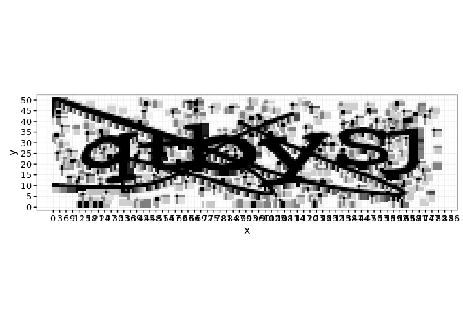
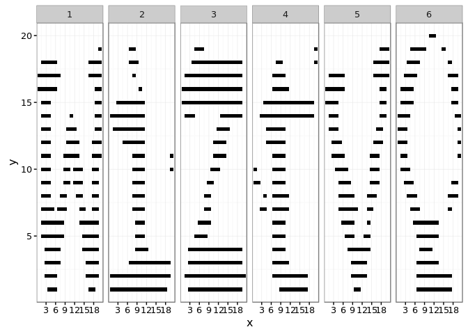
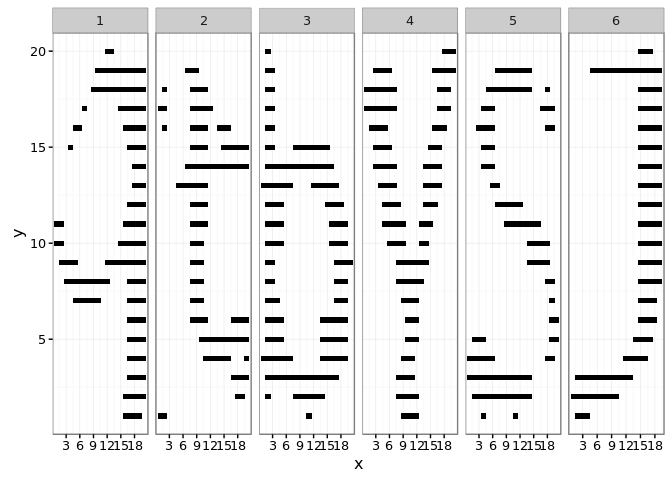
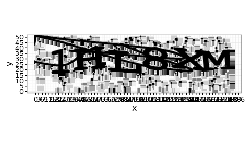

<!-- README.md is generated from README.Rmd. Please edit that file -->

** ESTE PACOTE NÂO ESTÁ MAIS ATIVO: TEMOS UMA VERSÃO MELHORADA [AQUI](https://github.com/decryptr/decryptr) **

Esse pacote serve para quebrar o *captcha* da Receita Federal que aparece [neste endereço](http://www.receita.fazenda.gov.br/pessoajuridica/cnpj/cnpjreva/cnpjreva_solicitacao2.asp).

Um exemplo deste *captcha* pode ser observado na imagem abaixo.

``` r
library(captchaReceita)
#> Loading required package: magrittr
library(magrittr)
a <- download() %>% ler()
b <- download() %>% ler()
a %>%
  desenhar()
```


``` r
b %>% 
  desenhar()
```



Preparação do banco de dados
----------------------------

Depois da classificação de 1100 captchas manualmente. Criamos um algoritmo capaz de processá-los em formatos que podem ser inseridos em um algoritmo de classificação.

Por exemplo, a imagem tratada fica neste formato.

``` r
a %>% captchaReceita:::processar() %>% desenhar()
```



``` r
b %>% captchaReceita:::processar() %>% desenhar()
```



Usamos a função `preparar` para preparar um banco de dados completo.

``` r
bd <- preparar(dir = "data-raw/")
```

Modelagem
---------

Depois de preparar o banco de dados, separamos o banco de dados em construção e validação e ajustamos um modelo de random forest.

A função `separar` separa o banco em duas partes.

``` r
bd_s <- separar(bd)
```

O ajuste do modelo foi realizado da seguinte forma.

``` r
library(randomForest)
modelo <- randomForest(letras ~ ., data = bd_s$treino %>% dplyr::select(-arqs))
```

Agora podemos verificar o acerto na base de validação com o seguinte comando:

    #> randomForest 4.6-12
    #> Type rfNews() to see new features/changes/bug fixes.

``` r
calcular_erro(bd_s$teste)
#>    acerto     valor
#> 1 captcha 0.8100000
#> 2   letra 0.9633333
```

Previsão
========

Para prever p/ um novo captcha, use os seguintes comandos:

``` r
arq <- download()
arq %>% ler() %>% desenhar()
```



``` r
decodificar(arq, modelo)
#> [1] "1hl8xm"
```
